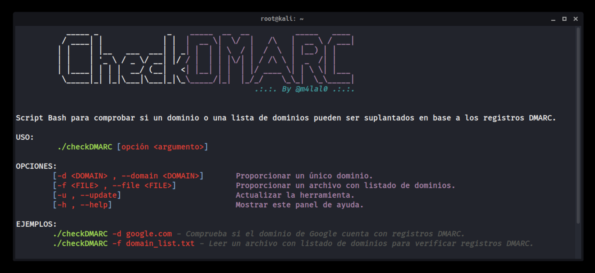
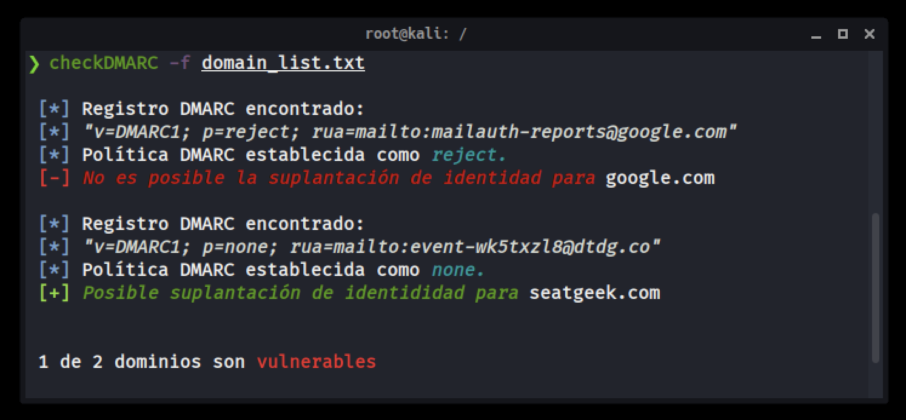

# checkDMARC

[](#)
[](#)
[](#)
[](#)



<h4 align="center">Script en Bash que comprueba un dominio o una lista de dominios desde un archivo que puedan ser suplantados en base a los registros DMARC.</h4><br>

---

## Instalación

```bash
git clone https://github.com/m4lal0/checkDMARC
cd checkDMARC; chmod +x checkDMARC.sh && mv checkDMARC.sh /usr/local/bin/checkDMARC
```

#3 ¿Cómo ejecuto la herramienta?

Para el funcionamiento, es necesario especificar el dominio usando el parámetro ***`-d`*** ó ***`--domain`***:

```bash
checkDMARC -d [DOMAIN]
```
o
```bash
checkDMARC --domain [DOMAIN]
```


Si cuenta con un archivo que tiene un listado de dominios puede usar el parámetro ***`-f`*** ó ***`--file`*** :

```bash
checkDMARC -f [DOMAIN_LIST]
```
o
```bash
checkDMARC --file [DOMAIN_LIST]
```



## Actualizar la herramienta

Para poder actualizar la herramienta es necesario ejecutarla con el parámetro ***`-u`*** ó ***`--update`***, con ello verifica si existe una nueva versión y si la acepta, se iniciará la actualización completa.

```bash
checkDMARC --update
```
