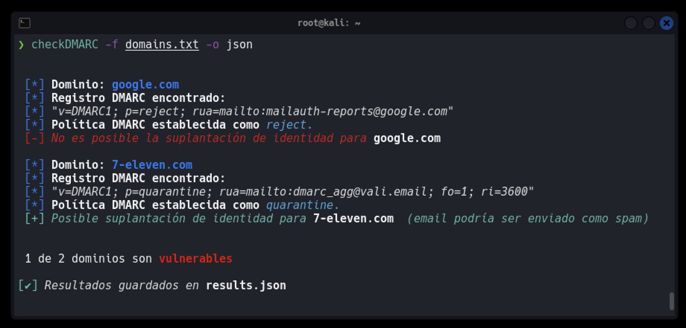

<p align="center"></p>

[](#)
[](#)
[](#)
[](#)
[](#)

# CheckDMARC

**CheckDMARC** es una herramienta de seguridad escrita en Bash que permite verificar la configuración de registros DMARC (Domain-based Message Authentication, Reporting, and Conformance) de uno o múltiples dominios para determinar si están correctamente protegidos contra ataques de suplantación de identidad (spoofing).

Esta herramienta es útil para administradores de sistemas, equipos de seguridad, analistas y profesionales interesados en validar la postura de seguridad del correo electrónico de sus dominios o los de terceros.

### 🔍 Características principales
- ✅ Verifica un solo dominio para comprobar si está protegido contra spoofing mediante DMARC.

- 📄 Procesa múltiples dominios desde un archivo y evalúa su política DMARC.

- 💾 Permite exportar los resultados en formatos .txt o .json.

# Instalación

```bash
git clone https://github.com/m4lal0/checkDMARC
cd checkDMARC; chmod +x checkDMARC.sh && mv checkDMARC.sh /usr/local/bin/checkDMARC
```

# ¿Cómo ejecuto la herramienta?

Para el funcionamiento, es necesario especificar el dominio usando el parámetro ***`-d`*** ó ***`--domain`***:

```bash
checkDMARC -d [DOMAIN]
```


Si cuenta con un archivo que tiene un listado de dominios puede usar el parámetro ***`-f`*** ó ***`--file`*** :

```bash
checkDMARC -f [DOMAIN_LIST]
```


Puede guardar los resultados usando el parámetro ***`-o`*** ó ***`--output`*** y especificando el formato ya sea en JSON o TXT :

```bash
checkDMARC -f [DOMAIN_LIST] -o json
```



## Actualizar la herramienta

Para poder actualizar la herramienta es necesario ejecutarla con el parámetro ***`-u`*** ó ***`--update`***, con ello verifica si existe una nueva versión y si la acepta, se iniciará la actualización completa.

```bash
checkDMARC --update
```